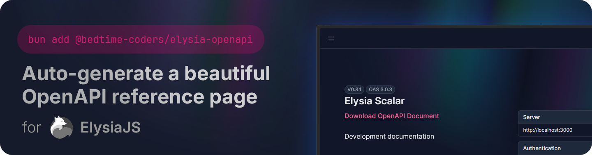

<div align="center">
    
    <a href="https://npmjs.com/package/@bedtime-coders/elysia-openapi">
        
    </a>
    <a href="https://bundlephobia.com/package/@bedtime-coders/elysia-openapi">
        
    </a>
    <a href="https://elysiajs.com/">
        
    </a>
</div>

<h1 align="center">
    @bedtime-coders/elysia-openapi
</h1>

Use this plugin to expose a beautiful [OpenAPI](https://github.com/OAI/OpenAPI-Specification) reference page from your ElysiaJS application with zero configuration. Just add the plugin to your Elysia app and you're good to go!

👉 **Why use this over `@elysiajs/swagger`?** This is a fork of `@elysiajs/swagger` with updated dependencies and a few opinionated changes to the defaults. If [@elysiajs/swagger](https://github.com/elysiajs/elysia-swagger) suits your needs (and you don't need the latest version of [Scalar API Reference](https://github.com/scalar/scalar/tree/main/packages/api-reference)), then by all means, use that instead.

## Add it to your Elysia app
```bash
bun add @bedtime-coders/elysia-openapi
```

## Try it out
```typescript
import { Elysia, t } from 'elysia'
import { openapi } from '@bedtime-coders/elysia-openapi'

const app = new Elysia()
    .use(openapi())
    .get('/', () => 'hi', { response: t.String({ description: 'sample description' }) })
    .post(
        '/json/:id',
        ({ body, params: { id }, query: { name } }) => ({
            ...body,
            id,
            name
        }),
        {
            params: t.Object({
                id: t.String()
            }),
            query: t.Object({
                name: t.String()
            }),
            body: t.Object({
                username: t.String(),
                password: t.String()
            }),
            response: t.Object({
                username: t.String(),
                password: t.String(),
                id: t.String(),
                name: t.String()
            }, { description: 'sample description' })
        }
    )
    .listen(8080);
```

Visit `http://localhost:8080/docs` to see the generated OpenAPI reference page ✨

## Give us a ⭐️

Hey! If you like this plugin, please give us a ⭐️ on GitHub so more people can find it. Thank you!

## Configuration for nerds

### `provider`
`@default 'scalar'`

Choose between [Scalar API Reference](https://github.com/scalar/scalar) & [Swagger UI](https://github.com/swagger-api/swagger-ui)

### `scalar`
Customize `scalarConfig`, refers to [Scalar config](https://github.com/scalar/scalar/blob/main/documentation/configuration.md)

### `swagger`
Customize Swagger config, refers to [Swagger 3.0.3 config](https://swagger.io/specification/v3)

### `path`
`@default '/docs'`

The endpoint to expose Swagger UI

### `excludeStaticFile`
`@default true`

Determine if Swagger should exclude static files.

### `exclude`
`@default []`

Paths to exclude from the Swagger endpoint

<!-- Badges-->

[license-src]: https://img.shields.io/github/license/bedtime-coders/elysia-openapi?color=blue
[license-href]: https://github.com/bedtime-coders/elysia-openapi/blob/main/LICENSE
[bundle-src]: https://img.shields.io/bundlephobia/minzip/@bedtime-coders/elysia-openapi?color=blue&label=bundlephobia
[bundle-href]: https://bundlephobia.com/package/@bedtime-coders/elysia-openapi
[elysia-src]: https://img.shields.io/badge/%F0%9F%A6%8A-f6f8fa?label=elysia&color=blue
[elysia-href]: https://elysiajs.com/
[npm-version-src]: https://img.shields.io/npm/v/@bedtime-coders/elysia-openapi?style=color=blue
[npm-version-href]: https://npmjs.com/package/@bedtime-coders/elysia-openapi
[github-stars-src]: https://img.shields.io/github/stars/bedtime-coders/elysia-openapi?color=blue
[github-stars-href]: https://github.com/bedtime-coders/elysia-openapi/stargazers

<!-- Public assets -->
[header-src]: ./public/header.png